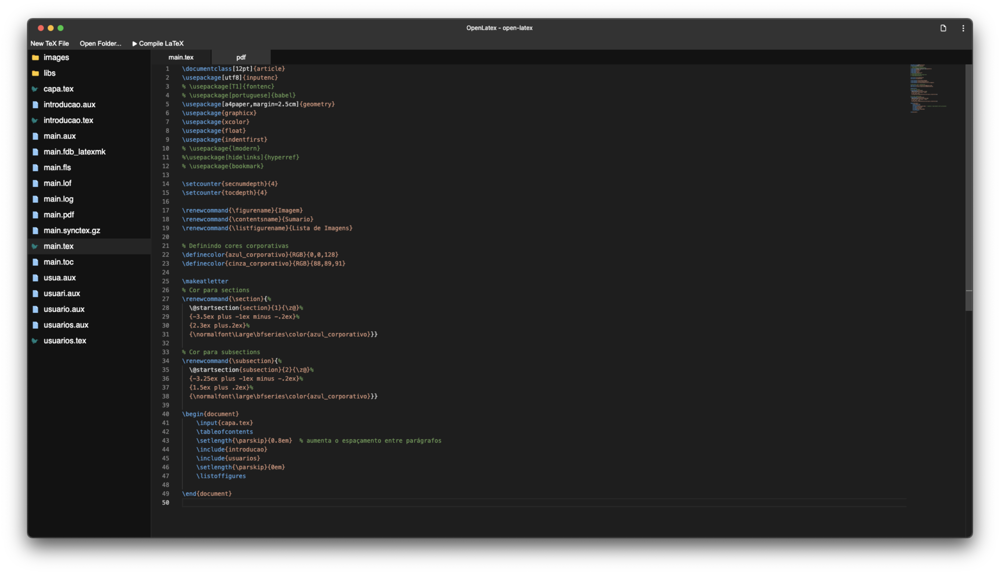
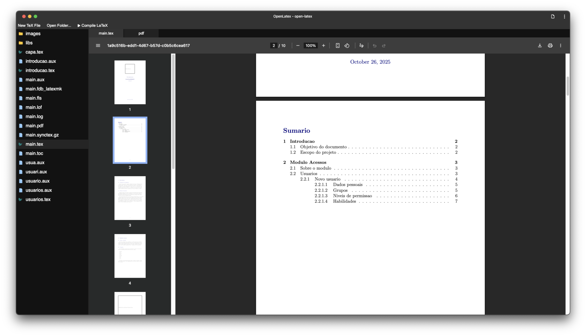

# OpenLatex

<https://digital-divas.github.io/open-latex>

OpenLatex is a LaTeX editor and compiler for browser.

It requires a "chromium-based" browser for opening local folders since it uses the [File System API](https://developer.mozilla.org/en-US/docs/Web/API/File_System_API).

The current version uses the compilation of PdfTex webAssembly built by [GitHub -> manuels](https://github.com/manuels/texlive.js).




## Developers

To run this project locally run the following:

```sh
nvm use
npm install
npm run dev
```
